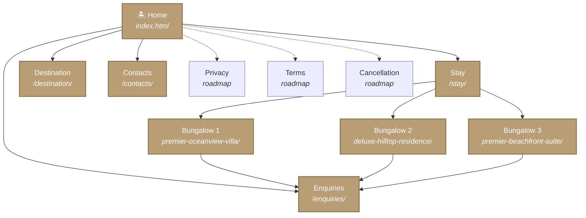
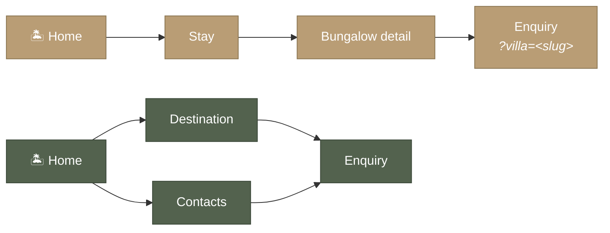

# Site Map — Vayana Bungalows

A bird's-eye view of every page on the [Vayana Bungalows site](https://noobcoder1209.github.io/vayana-bungalows/) and how they connect.

> **Status:** All eight pages below are **built** and live. New pages (privacy, terms, cancellation) are tracked as roadmap items.

---

## Top-level structure



> **Gold = built.** White (roadmap) = footer policy pages not yet shipped.

The plain-text version:

```
Vayana Bungalows
│
├── Home  ──────────────────  /
│                             landing page, full storytelling scroll
│
├── Stay  ──────────────────  /stay/
│   │                         the three-bungalow index
│   ├── Bungalow 1  ────────  /premier-oceanview-villa/
│   ├── Bungalow 2  ────────  /deluxe-hilltop-residence/
│   └── Bungalow 3  ────────  /premier-beachfront-suite/
│
├── Destination  ──────────  /destination/
│                             area guide + map + directions
│
├── Contacts  ─────────────  /contacts/
│                             phone, email, address, map, reply note
│
└── Enquiries  ─────────────  /enquiries/
                              date-picker enquiry form (v1 stub)
```

---

## User journeys



- **Gold path** — booking journey (Home → Stay → Bungalow → Enquiry, with the villa slug pre-filled into the form)
- **Sage path** — research journey (Home → Destination/Contacts → Enquiry)

---

## Pages

### Home — `/`

Long-form landing page. Hero, intro, gallery, three-bungalow preview, location, testimonials, newsletter, footer. The whole site's story in one scroll.

> **Built** — `index.html` at the repo root.

---

### Stay — `/stay/`

Index of the three Vayana bungalows. Hero photo (intro-villa.jpg) + short intro prose + three room cards in a stable 3-up grid (no carousel — this IS the index page). Each card links to its bungalow detail page.

> **Built** — `stay/index.html`. Closed by issue #12.

---

### Bungalow detail pages — `/<bungalow-slug>/`

Three detail pages, one per villa. Same template, different content. Each ships a hero, an overview block, a feature grid, a gallery, and a "Book this villa" CTA that links to `/enquiries/?villa=<slug>` (pre-fills the message textarea).

| Slug | Built |
|---|---|
| `/premier-oceanview-villa/` | yes |
| `/deluxe-hilltop-residence/` | yes |
| `/premier-beachfront-suite/` | yes |

Slugs are intentionally stable from the original room-card hrefs on the homepage (pre-existing inbound links must keep working).

---

### Destination — `/destination/`

Area guide. Two sections:

1. **Area & things to do** — hero photo + intro prose + 4 alternating editorial rows (Beach / Food / Hiking / Culture).
2. **Map & directions** — reuses the homepage `.location` Google-Maps iframe + a `.destination-directions` sub-block (BOJ ~85 km, SOF ~410 km, parking note).

> **Built** — `destination/index.html`. Closed by issue #13.

---

### Contacts — `/contacts/`

Phone, email, and address as 3-up cards with inline SVG icons. Each card surfaces one channel. Includes the same `.location` map iframe + a "We reply within 24-48 hours" note + a CTA to `/enquiries/`.

> **Built** — `contacts/index.html`. Closed by issue #14.

---

### Enquiries — `/enquiries/`

The enquiry form (v1 stub). Full UI + client-side validation + flatpickr date range picker + thank-you modal — but **no network request leaves the browser** in v1. Real Cloudflare Worker submission lives behind issue #15; captcha decision behind #20.

> **Built** — `enquiries/index.html`. Tracks issue #11.

---

## Footer pages (roadmap)

Linked from the footer policies column on every page; today the hrefs 404. Tracked separately:

| Page | Issue | Purpose |
|---|---|---|
| **Privacy** | #16 | Privacy policy / GDPR disclosure (needed for the enquiry-form consent line) |
| **Terms & Conditions** | #17 | Site terms |
| **Cancellation Policy** | #18 | Booking / cancellation policy |

---

## Multi-page build

This is a Vite multi-page app — every entry in `vite.config.js`'s `rollupOptions.input` emits its own `index.html` under the matching folder. On GitHub Pages the site is served from `/vayana-bungalows/`, so Vite's `base` is set to that subpath at build time (and `/` in dev).

```
vite.config.js inputs
├── home                       → index.html
├── stay                       → stay/index.html
├── destination                → destination/index.html
├── contacts                   → contacts/index.html
├── enquiries                  → enquiries/index.html
├── premierOceanviewVilla      → premier-oceanview-villa/index.html
├── deluxeHilltopResidence     → deluxe-hilltop-residence/index.html
└── premierBeachfrontSuite     → premier-beachfront-suite/index.html
```

---

## Cross-page invariants (KEEP-IN-SYNC)

Three blocks must round-trip identically across all 8 entry pages because there's no shared layout primitive (yet):

1. **Header** — logo, hamburger toggle, Call CTA, Enquiries pill.
2. **Drawer / `<noscript>` fallback** — 4 nav links (Home, Stay, Destination, Contacts) + Enquiries + phone.
3. **Footer** — contact column, social column, policies column (with Enquire link), copyright bar.

Each page carries a `KEEP IN SYNC` HTML comment listing the other 7 entries so future edits propagate everywhere.
