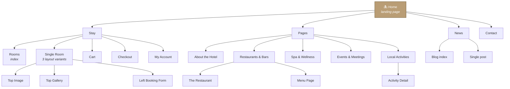
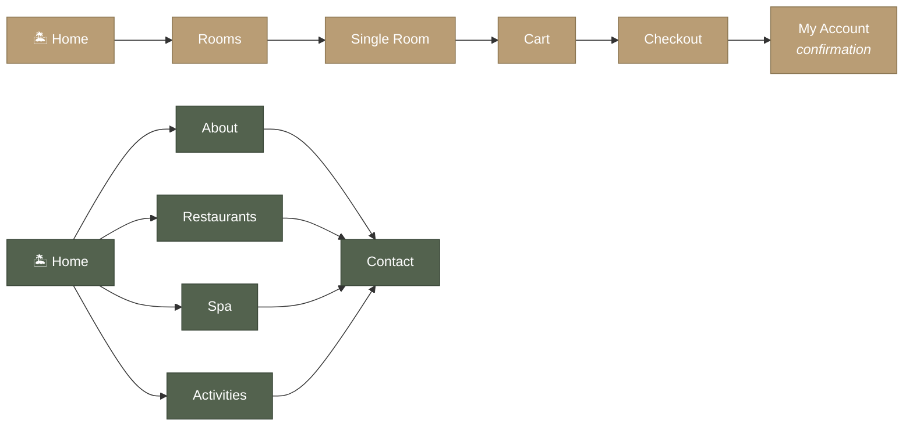
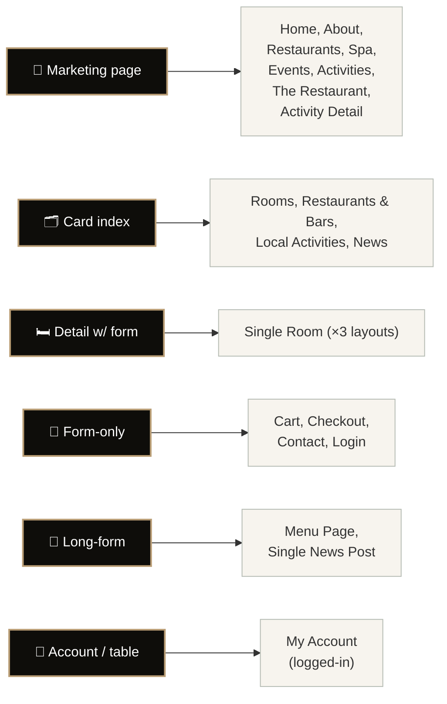
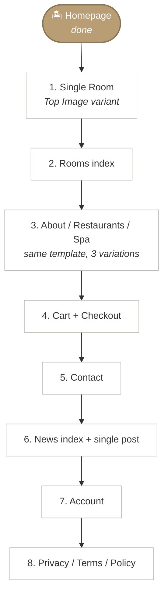

# Site Map — Island Resort Demo

A bird's-eye view of every page in the [CozyStay Island Resort demo](https://cozystay.loftocean.com/island-resort/) and how they connect. Use this as the roadmap for the work after the homepage — it's the order I'd build them in if we keep going.

> **Status:** Of the pages below, only the **Homepage** is implemented in this repo so far (`index.html`). Everything else is on the roadmap.

---

## Top-level structure



> **Gold = built**, white = roadmap.

The plain-text version, if Mermaid doesn't render for you:

```
Island Resort
│
├── Home  ──────────────────  the landing page (this repo)
│
├── Stay  ──────────────────  rooms, booking flow, account
│   ├── Rooms (index)
│   ├── Single Room (3 layout variants)
│   │   ├── Top Image layout
│   │   ├── Top Gallery layout
│   │   └── Left Booking Form layout
│   ├── Cart
│   ├── Checkout
│   └── My Account
│
├── Pages  ─────────────────  marketing & info pages
│   ├── About the Hotel
│   ├── Restaurants & Bars
│   │   ├── The Restaurant
│   │   └── Menu Page
│   ├── Spa & Wellness
│   ├── Events & Meetings
│   ├── Local Activities
│   │   └── Activity Detail Page
│   └── Contact
│
└── News  ──────────────────  blog index + single posts
```

---

## User journeys

The two journeys most users follow:



- **Gold path** — booking journey (intent to convert)
- **Sage path** — research journey (intent to learn, ends in inquiry)

---

## Pages

### Home — `/island-resort/`

The landing page. Hero, booking widget, intro split, gallery carousel, video band, rooms preview (4 cards), three experience tiles (spa/activities/dining), image CTA, testimonial, services grid, newsletter, contact info, footer. Sells the property in one scroll.

> **Built** — `index.html` in this repo.

---

### Stay

#### Rooms — `/island-resort/rooms/`
Index of every room type. Card grid with image, name, "from" price, short description, and a "Discover more" link to the single room. Often filterable by occupancy/view.

#### Single Room — `/island-resort/room/<slug>/`
Detail page for one room type. The demo ships **three layout variants** so buyers can pick the look they prefer:
- **Top Image** — `/room/premier-oceanview-villa/` — large hero photo above the fold, then specs and a sticky booking sidebar
- **Top Gallery** — `/room/deluxe-hilltop-residence/` — slider with multiple photos at the top, content below
- **Left Booking Form** — `/room/premier-beachfront-suite/` — booking form anchored on the left, scrolling content on the right

Plus the named rooms: `grand-oceanview-residence`, `honeymoon-suite`. Same template, different content.

#### Cart — `/island-resort/cart/`
Reservation summary before payment. Lists the selected room, dates, guests, extras, total. Edit/remove buttons.

#### Checkout — `/island-resort/checkout/`
Guest details + payment form. Billing fields, payment method selector, order recap on the right, place-reservation button.

#### My Account — `/island-resort/my-account/`
Login/register screen, then account dashboard once logged in (orders, addresses, password).

---

### Pages

#### About the Hotel — `/island-resort/about-the-hotel/`
The brand story. Founders, philosophy, history, a few "by the numbers" stats, team photos, awards.

#### Restaurants & Bars — `/island-resort/restaurants-bars/`
Index of every dining venue on the property. Each venue gets a card with photo, hours, cuisine, and a link into its detail page.

#### The Restaurant — `/island-resort/the-restaurant/`
Detail page for one specific venue. Concept, chef bio, gallery, hours, dress code, "view menu" CTA.

#### Menu Page — `/island-resort/menu-page/`
The actual food menu. Sections (starters, mains, desserts, drinks), prices, dietary tags. Often a downloadable PDF link too.

#### Spa & Wellness — `/island-resort/spa-wellness/`
The spa experience. Treatment menu, philosophy, signature rituals, "book a treatment" form or contact CTA.

#### Events & Meetings — `/island-resort/events-meetings/`
B2B page for weddings, retreats, corporate events. Capacity tables for each room, sample setups, an inquiry form.

#### Local Activities — `/island-resort/local-activities/`
Things to do off-property. Card grid: snorkeling, hiking, day trips, cultural tours.

#### Activity Detail Page — `/island-resort/activity-detail/`
One specific activity. Hero photo, what's included, duration, price, what to bring, booking form.

#### Contact — `/island-resort/contact/`
Address, phone, email, embedded map, contact form, sometimes per-department contact (reservations / press / careers).

---

### News

#### Blog index — `/island-resort/news/`
Reverse-chronological list of stories. Card layout with cover photo, date, title, excerpt, "read more" link.

#### Single post
Individual blog post. Hero photo, title, byline, published date, body, related posts, comments.

---

## Footer pages

Linked from the footer but not the main nav:

| Page | Purpose |
|---|---|
| **Privacy** | Privacy policy / GDPR disclosure |
| **Terms of Use** | Site terms |
| **Policy** | Booking / cancellation policy |

---

## Page-template reuse

Most of the design language is captured by **six unique templates** — once those are built, every page in the site is a content-only variation:



So the realistic build order from here is:



Why this order:
- **Single Room first** — biggest visual lift after the homepage, drives bookings, room cards on the homepage already preview the design language
- **Rooms index** is cheap once the room card style is locked in
- **About/Restaurants/Spa** all share one template, so it's effectively one page of work for three deliverables
- **Cart + Checkout** are forms — same template, fast
- **News and Account** are the lowest priority for a marketing site

---

## How this compares to the live demo

The live CozyStay demo is a WordPress site with WooCommerce-style cart/checkout, a custom-post-type for rooms, and Elementor-built page templates. This repo is hand-written static HTML — the look will match, but the data layer (real booking, real cart) is out of scope. Cart/Checkout/My Account would be **visual** unless you wire them up to a real backend later.
