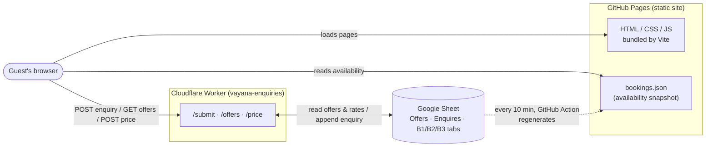
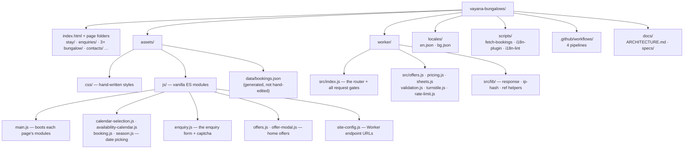
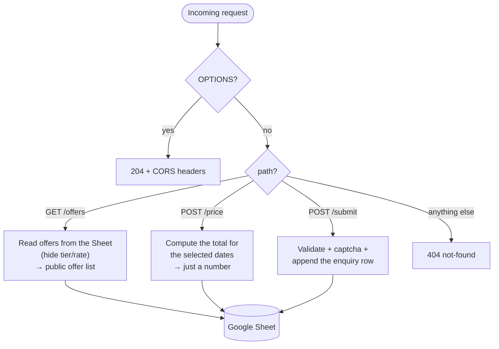
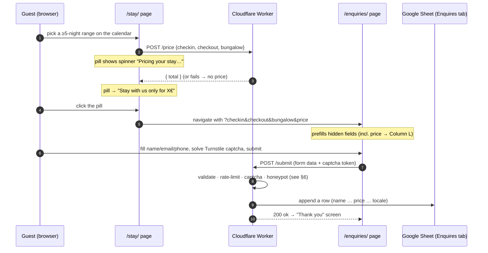
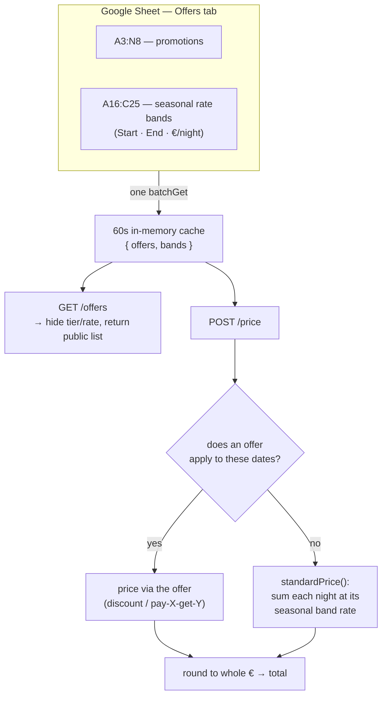
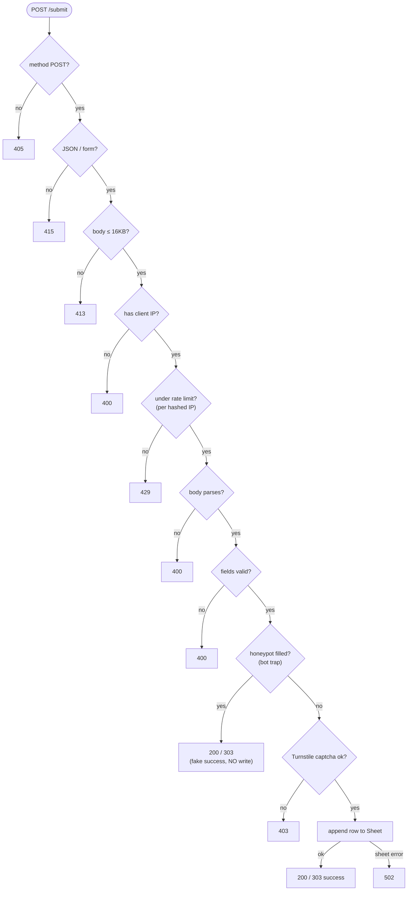
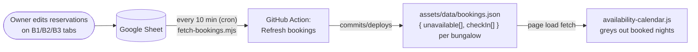
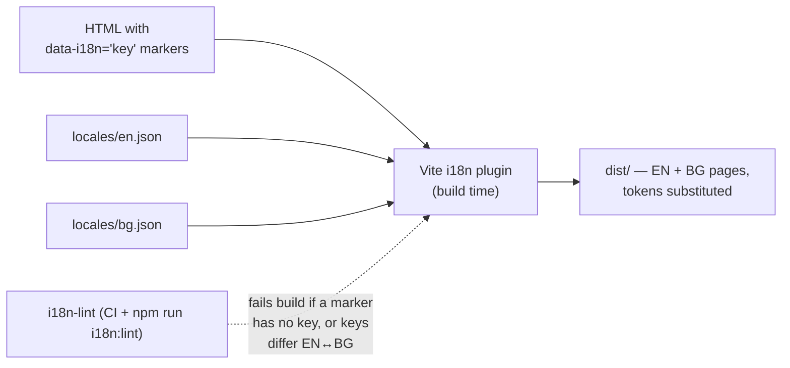
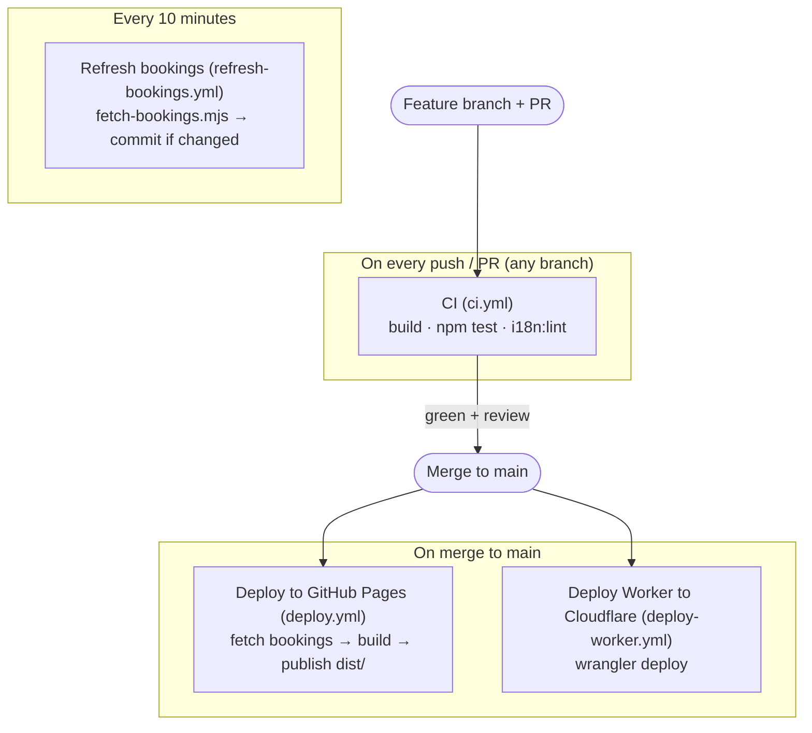

# Architecture — Vayana Bungalows

> **New here? Start with this file.** It explains what the project is, how the
> pieces fit together, and where each process lives — using diagrams. It pairs
> with the [README](../README.md) (setup, scripts, deploy commands). Diagrams
> are [Mermaid](https://mermaid.js.org/) and render automatically on GitHub.

---

## 1. What this is, in one picture

Vayana Bungalows is a **boutique-resort marketing site** with a booking-enquiry
flow. There is **no database and no backend server** in the traditional sense:

- The **website** is static files (HTML/CSS/vanilla JS) built by Vite and hosted
  on **GitHub Pages**.
- A single **Cloudflare Worker** handles the three dynamic things: taking enquiry
  submissions, serving special offers, and pricing a stay.
- **Google Sheets is the "database."** The resort owner edits a spreadsheet;
  everything dynamic reads from or writes to it.

**The one idea to hold onto:** the owner only ever touches the **Google Sheet**.
Guests see a fast static site; the Worker is the thin, secured bridge between the
two.

---

## 2. Where everything lives (repo map)

**Rule of thumb for a new dev:**
- Changing how a page *looks* → `assets/css` + the page's `index.html`.
- Changing page *behavior* → the matching module in `assets/js`.
- Changing what the Worker *accepts / returns* → `worker/src/index.js` (+ the
  helper it calls).
- Changing *copy* (any visible text) → `locales/en.json` **and** `locales/bg.json`.

---

## 3. The three Worker routes at a glance

The Worker is one script (`worker/src/index.js`) with exactly three routes plus a
CORS preflight. Everything else 404s.

- **`GET /offers`** — public, cacheable. Powers the home-page offers section.
- **`POST /price`** — public. Given check-in/out, returns *only* the total euro
  price (the per-night tier rates never reach the browser).
- **`POST /submit`** — the enquiry form action. Guarded (see §6).

All three read the **same Google Sheet**; `/offers` and `/price` share one cached
read (see §5).

---

## 4. Enquiry flow (the money path)

What happens when a guest picks dates and sends an enquiry.

**Key point:** the price shown on `/stay/` is carried to the enquiry as a URL
param, dropped into a hidden field, and written by the Worker into the **Price
column (L)** of the Enquires tab. If `/price` can't produce a number, the guest
can still enquire — the price is just left blank for the owner to fill.

---

## 5. Offers & pricing — how the Sheet drives money

Both `/offers` and `/price` read the **Offers tab** in one round-trip and cache it
for 60 seconds. The tab holds two things:

- **Rows 3–8 (`A3:N8`) — the offers/promotions** (e.g. "stay 9 nights, pay 6").
- **Rows 16–25 (`A16:C25`) — the seasonal rate table** (date band → €/night),
  used to price a stay when *no* offer applies.

**Two things a new dev must know here:**

1. **The cache never stores an *empty* rate table.** An empty read is treated as a
   transient glitch (the table is a permanent fixture), so it isn't cached — the
   next request re-reads and recovers. This is what keeps the price from
   intermittently going blank. See `getCachedData` in `worker/src/offers.js`.
2. **Rate-band dates are matched by month/day, ignoring the year** — the sheet's
   2026 dates are a *template* that applies to April–September of any year. Band
   **End is inclusive** (the last night charged), which is the *opposite* of an
   offer window's end (the checkout day, exclusive). Don't conflate them.

---

## 6. Enquiry security gates (`POST /submit`)

`/submit` runs a fixed sequence of cheap-to-expensive gates. Anything that fails
short-circuits; the expensive captcha call only runs if everything before it
passed. This mirrors the numbered comments at the top of `worker/src/index.js`.

**Why this order matters:** bots and abuse are rejected before the Worker spends
a network call on captcha verification or a Sheets write. The **honeypot** is a
hidden field no human fills; if it's filled, the Worker fakes success (so the bot
can't tell it was caught) but writes nothing. Errors never echo internal details
to the client (no leaking of the service-account key, etc.).

---

## 7. Availability — how booked dates reach the calendar

The owner records reservations on the **B1/B2/B3 2026 tabs** of the same Sheet. A
scheduled GitHub Action turns those into a static `bookings.json` the site reads —
so the calendar knows which nights are taken *without* any live call at page load.

`bookings.json` is **generated, never hand-edited**. If availability looks stale,
the fix is the sheet + the refresh job, not the JSON file.

---

## 8. Internationalization (EN / BG)

The site ships in English and Bulgarian. Translation happens at **build time**, not
in the browser: elements carry `data-i18n` markers, and a Vite plugin
(`scripts/i18n-plugin.js`) bakes the right strings from `locales/*.json` into the
output, interpolating `{tokens}`.

**The rule new devs trip on:** any visible text must exist in **both** `en.json`
and `bg.json` with matching keys, or `i18n:lint` (and CI) fails. Exception: a few
JS-generated strings (e.g. the `/stay/` price pill labels) are hardcoded English
in the module — that component isn't wired to the i18n dictionary.

---

## 9. Build, test & deploy pipelines

Four GitHub Actions workflows in `.github/workflows/`:

**Developer workflow:** branch (`feature/…`, `fix/…`, `docs/…`) → PR → CI green +
review → squash-merge to `main` → the site and/or Worker auto-deploy. Never push
straight to `main`.

---

## 10. Cheat-sheet: "I want to change X"

| I want to… | Touch this | Then |
|---|---|---|
| Edit a promotion / its discount | The **Offers tab** (rows 3–8) in the Sheet | Live within ~60s (cache) |
| Change the standard nightly price | The **rate table** (rows 16–25) in the Sheet | Live within ~60s |
| Change a booked-date / availability | The **B1/B2/B3 tabs** in the Sheet | Live after the 10-min refresh job |
| Change visible copy | `locales/en.json` **and** `bg.json` | PR → merge (deploys the site) |
| Change a page's layout/look | that page's `index.html` + `assets/css` | PR → merge |
| Change page behavior (calendar, form) | the module in `assets/js` | PR → merge; add/adjust tests |
| Change what the Worker accepts/returns | `worker/src/index.js` (+ helpers) | PR → merge (deploys the Worker) |
| Add a Worker secret (keys, sheet id) | `wrangler secret put …` (not in git) | Redeploy the Worker |

---

## 11. Glossary

- **Worker** — the Cloudflare serverless script (`worker/`); the only thing that
  talks to Google Sheets with credentials.
- **Offers tab** — one sheet tab holding both promotions and the seasonal rate
  table.
- **Enquires tab** — where submitted enquiries land as rows (price = Column L).
- **bookings.json** — a generated availability snapshot the calendar reads; refreshed
  by a cron Action, never hand-edited.
- **Turnstile** — Cloudflare's captcha, verified server-side before any sheet write.
- **Honeypot** — a hidden form field; if a bot fills it, the Worker fakes success
  and writes nothing.
- **i18n plugin** — the Vite build step that bakes EN/BG copy into the static pages.

---

*Keep this file honest: if you change a flow, update the matching diagram in the
same PR. Diagrams that lie are worse than no diagrams.*
